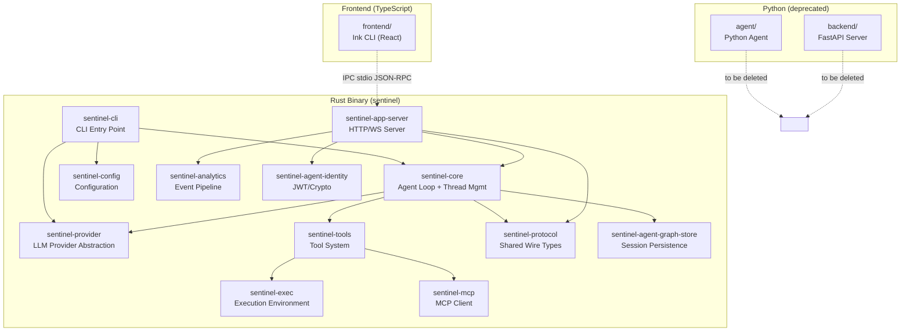
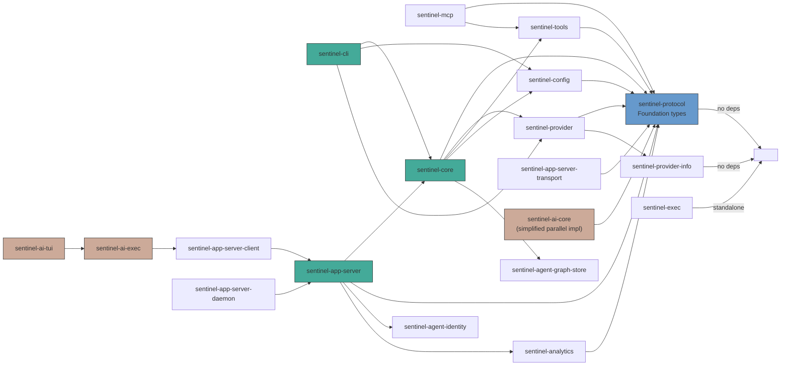
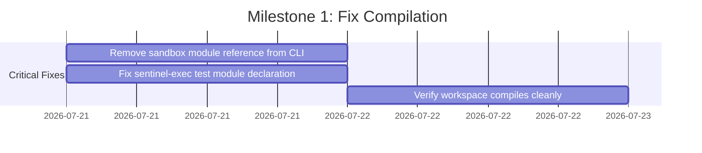
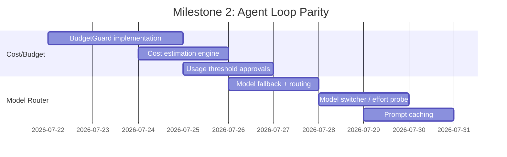
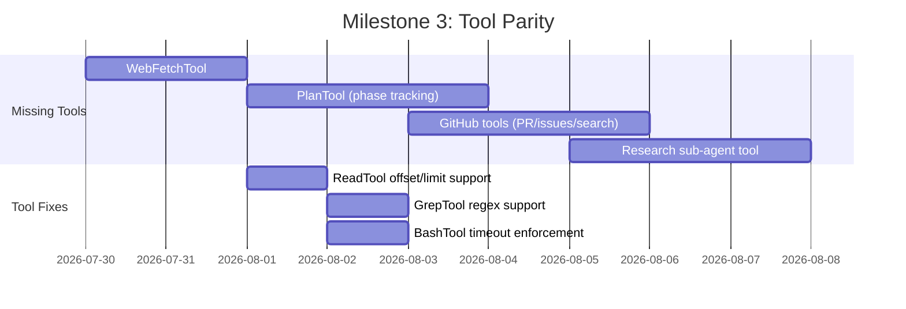
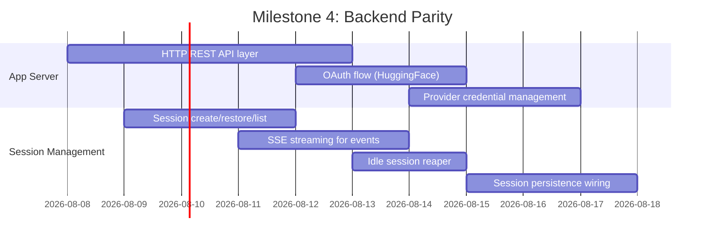
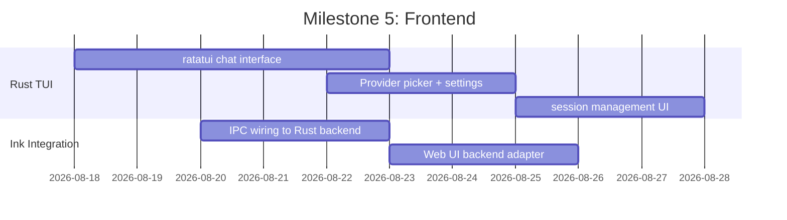
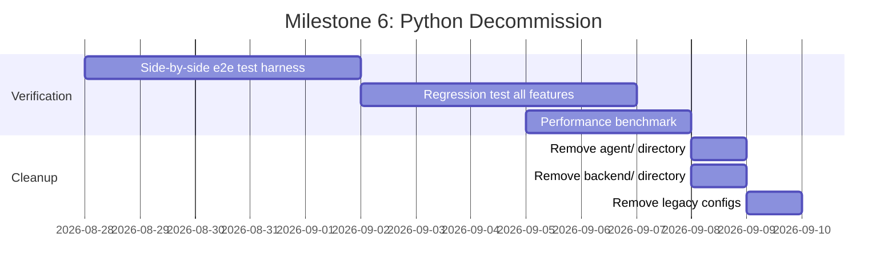
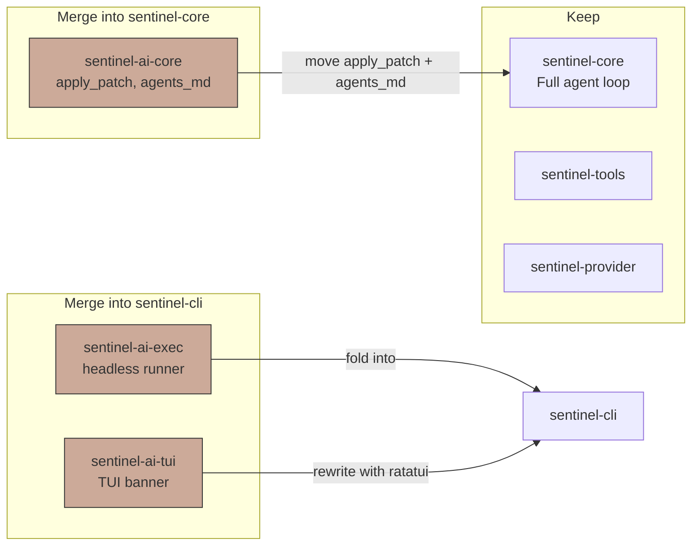

# Sentinel-AI Rust Migration Plan

> Complete migration of Python `agent/` + `backend/` to Rust crates
> Current: Python + TypeScript | Target: Rust workspace + TypeScript Ink frontend
> Rust parity: ~55-65% | Target: 100%

---

## Architecture Overview



---

## Crate Dependency Graph



---

## Python → Rust Module Mapping

### Agent Core (agent/core/)

| Python Module | Rust Crate | Status | Action |
|---|---|---|---|
| `agent_loop.py` | `sentinel-core::agent` | Done | Already migrated |
| `session.py` | `sentinel-core::thread` + `sentinel-agent-graph-store` | Partial | Session persistence not wired |
| `approval_policy.py` | `sentinel-core::ApprovalGate` | Done | Already migrated |
| `yolo_budget.py` | `sentinel-core` | **Missing** | Budget/cost tracking not implemented |
| `cost_estimation.py` | `sentinel-core` | **Missing** | Cost estimation not implemented |
| `doom_loop.py` | `sentinel-core::thread::is_doom_loop` | Partial | Count-based only, no pattern detection |
| `model_router.py` | `sentinel-provider` | Partial | No model router/fallback |
| `model_switcher.py` | `sentinel-provider` | **Missing** | Effort probe model switching |
| `model_ids.py` | `sentinel-provider-info` | Partial | Only 4 providers defined |
| `llm_params.py` | `sentinel-core` | **Missing** | LiteLLM param resolution |
| `prompt_caching.py` | `sentinel-provider` | **Missing** | Prompt caching not implemented |
| `tools.py` | `sentinel-tools::ToolRegistry` | Done | Already migrated |
| `plan.py` | `sentinel-tools` | **Missing** | Plan tool not implemented |
| `telemetry.py` | `sentinel-analytics` | Partial | Stub/no sink |
| `usage_metrics.py` | `sentinel-core` | **Missing** | Usage metrics collection |
| `usage_thresholds.py` | `sentinel-core` | **Missing** | Usage threshold approvals |
| `session_persistence.py` | `sentinel-agent-graph-store` | Done | SQLite store exists |
| `context_manager/` | `sentinel-core::context` | Partial | Compaction is truncation-only |
| `messaging/` | `sentinel-core::EventHandler` | Partial | No Slack gateway |
| `subagents/` | `sentinel-core::thread::fork` | Partial | Local only, no subagent protocol |

### Tools (agent/tools/)

| Python Tool | Rust Equivalent | Status | Action |
|---|---|---|---|
| `local_tools.py` (read/write/edit) | `sentinel-tools::builtin` read/write/edit | Done | Offset/limit stubbed |
| `git_tools.py` | `sentinel-tools::builtin` git_* | Done | 4 git tools implemented |
| `web_search_tool.py` | `sentinel-tools::builtin` WebSearchTool | Done | Uses Wikipedia API |
| `web_fetch_tool.py` | **Missing** | **Missing** | Not implemented |
| `plan_tool.py` | **Missing** | **Missing** | Plan/phase tracking not implemented |
| `github_tools.py` | **Missing** | **Missing** | GitHub API tools not implemented |
| `docs_tools.py` | **Missing** | **Missing** | Documentation search not implemented |
| `research_tool.py` | **Missing** | **Missing** | Research sub-agent not implemented |

### Configuration (agent/config.py)

| Feature | Rust Equivalent | Status |
|---|---|---|
| TOML config loading | `sentinel-config` | Done |
| Env var substitution | `sentinel-config` | Done |
| Provider registry | `sentinel-provider-info` | Done |
| MCP server config | `sentinel-config` | Done |

### Backend (backend/)

| Python Module | Rust Equivalent | Status | Action |
|---|---|---|---|
| `main.py` (FastAPI) | `sentinel-app-server` | Partial | JSON-RPC over stdio/TCP, no HTTP REST |
| `session_manager.py` | `sentinel-core::ThreadManager` + `sentinel-app-server::AppSession` | Partial | No session persistence wiring |
| `models.py` (Pydantic) | `sentinel-app-server-protocol` | Partial | JSON-RPC types exist |
| `dependencies.py` (auth) | `sentinel-app-server-transport::auth` | Partial | JWT auth, no OAuth |
| `routes/auth.py` (OAuth) | **Missing** | **Missing** | No OAuth flow |
| `routes/providers.py` | **Missing** | **Missing** | No provider management endpoints |
| `provider_auth.py` | **Missing** | **Missing** | No credential management |
| SSE streaming | `sentinel-app-server::AppSession::chat_stream` | Partial | Collects chunks before returning |
| Event broadcasting | `sentinel-analytics` + `sentinel-app-server` | Partial | No real-time SSE |

### Frontend (frontend/)

| Component | Status | Action |
|---|---|---|
| Ink CLI (React) | Keep as-is | IPC via JSON-RPC |
| Web UI (MUI) | Keep as-is | Connects to Rust backend |
| Rust TUI (`sentinel-ai-tui`) | Missing | Needs full ratatui implementation |

---

## Milestone Plan

### Milestone 1: Fix Critical Compilation Errors (Week 1)



**Files to fix:**
1. `crates/sentinel-cli/src/main.rs` — remove `sandbox::run()` reference (module file deleted)
2. `crates/sentinel-exec/src/lib.rs` — fix `mod local_test` declaration (file missing)

**Deliverable:** `cargo build --workspace` succeeds with 21 crates.

---

### Milestone 2: Core Feature Parity — Agent Loop (Week 2-3)



**Rust crates to update:**
- `sentinel-core` — add `BudgetGuard`, `CostEstimator`, `UsageThresholds`
- `sentinel-provider` — add `ModelRouter` with fallback, effort-based model selection
- `sentinel-provider` — add prompt caching (token counting, cache headers)
- `sentinel-provider-info` — add Gemini provider

**Deliverable:** Rust agent has budget enforcement, model fallback, cost tracking.

---

### Milestone 3: Tool Parity (Week 4-5)



**New crates/tools:**
- `sentinel-tools` — add `WebFetchTool`, `PlanTool`, `GitHubTool`, `DocsTool`
- `sentinel-tools` — fix `ReadTool` offset/limit, `GrepTool` regex, `BashTool` timeout
- `sentinel-core` — wire plan tool into agent loop

**Deliverable:** All Python tools have Rust equivalents.

---

### Milestone 4: Backend Parity — App Server (Week 6-8)



**New/modified crates:**
- `sentinel-app-server` — add HTTP REST endpoints, SSE streaming, OAuth middleware
- `sentinel-app-server-protocol` — add REST API types alongside JSON-RPC
- `sentinel-app-server-transport` — add HTTP transport with axum/actix
- `sentinel-core` — wire `sentinel-agent-graph-store` into session lifecycle

**Deliverable:** Rust app server matches FastAPI feature set.

---

### Milestone 5: Frontend + TUI (Week 9-10)



**New/modified:**
- `sentinel-ai-tui` — rewrite with `ratatui` for real-time chat, provider picker, session list
- `sentinel-cli` — add `sentinel tui` subcommand that connects to app server
- `sentinel-app-server-client` — add HTTP client variant

**Deliverable:** Full TUI and Ink CLI both work with Rust backend.

---

### Milestone 6: Decommission Python (Week 11-12)



**Deliverable:** Python `agent/` and `backend/` directories deleted. All functionality runs on Rust.

---

## Execution Order

### Phase 1: Fix What's Broken

1. **`sentinel-cli/src/main.rs`** — remove `sandbox::run(sub_args).await?` and `mod sandbox;`
2. **`sentinel-exec/src/lib.rs`** — remove `mod local_test;` since `local_test.rs` is gone

### Phase 2: Core Agent Gaps

3. **BudgetGuard** (`sentinel-core`) — track per-session spend, cap enforcement, reconcile
4. **CostEstimation** (`sentinel-core`) — estimate tool call costs from schema/config
5. **ModelRouter** (`sentinel-provider`) — fallback chain, effort-based routing
6. **ModelSwitcher** (`sentinel-provider`) — automatically select cheap/strong model
7. **UsageThresholds** (`sentinel-core`) — threshold-based approval triggers
8. **PromptCaching** (`sentinel-provider`) — cache-aware request formatting

### Phase 3: Tools

9. **WebFetchTool** (`sentinel-tools`) — HTTP fetch with markdown conversion
10. **PlanTool** (`sentinel-tools`) — create/update/complete plan phases
11. **GitHubTools** (`sentinel-tools`) — search repos, read files, create PRs
12. **ResearchTool** (`sentinel-tools`) — sub-agent-based research
13. **Fix ReadTool** — implement offset/limit
14. **Fix GrepTool** — switch from contains() to regex
15. **Fix BashTool** — enforce timeout

### Phase 4: Backend

16. **HTTP REST layer** (`sentinel-app-server`) — use `axum` for FastAPI-compatible REST
17. **OAuth flow** — HuggingFace OAuth with cookie-based sessions
18. **SSE streaming** — real-time event broadcast to connected clients
19. **Provider management** — CRUD for LLM provider credentials
20. **Session persistence** — wire `sentinel-agent-graph-store` into `AppSession`

### Phase 5: Decommission

21. **E2E test harness** — run same tasks against Python and Rust, compare outputs
22. **Delete Python agent/** — after full parity verified
23. **Delete Python backend/** — after full parity verified

---

## Current Critical Issues

| Issue | File | Impact |
|---|---|---|
| `sandbox::run` reference | `sentinel-cli/src/main.rs:37` | **Compilation failure** |
| `mod local_test` missing file | `sentinel-exec/src/lib.rs` | **Compilation failure** |
| No budget/cost tracking | `sentinel-core` | PROD BLOCKER — no spend limits |
| No model fallback | `sentinel-provider` | PROD BLOCKER — single point of failure |
| LLM retry+timeout missing | `sentinel-provider` | PROD BLOCKER — flaky on network issues |
| No session persistence | `sentinel-core` + `sentinel-app-server` | No resume capability |
| Duplicate agent cores | `sentinel-core` vs `sentinel-ai-core` | Confusion, maintenance burden |

---

## Deletion Target: Python Files

### `agent/` Directory (to be deleted)

| File | Rust Replacement | Status |
|---|---|---|
| `agent/main.py` | `sentinel-cli` + `sentinel-ai-tui` | Partial |
| `agent/loop.py` | `sentinel-core::agent::run` | Done |
| `agent/context.py` | `sentinel-core::context::ContextManager` | Partial |
| `agent/router.py` | `sentinel-tools::ToolRegistry` | Done |
| `agent/gate.py` | `sentinel-core::ApprovalGate` | Done |
| `agent/shell.py` | `sentinel-cli` | Partial |
| `agent/config.py` | `sentinel-config` | Done |
| `agent/core/agent_loop.py` | `sentinel-core::agent` | Done |
| `agent/core/session.py` | `sentinel-core::thread::AgentThread` | Done |
| `agent/core/model_router.py` | `sentinel-provider::ProviderKind` | Partial |
| `agent/core/tools.py` | `sentinel-tools::ToolRegistry` | Done |
| `agent/core/llm_params.py` | `sentinel-provider` | Missing |
| `agent/core/plan.py` | `sentinel-tools::PlanTool` | Missing |
| `agent/core/doom_loop.py` | `sentinel-core::thread::is_doom_loop` | Partial |
| `agent/core/yolo_budget.py` | `sentinel-core` | Missing |
| `agent/core/cost_estimation.py` | `sentinel-core` | Missing |
| `agent/core/usage_metrics.py` | `sentinel-core` | Missing |
| `agent/core/usage_thresholds.py` | `sentinel-core` | Missing |
| `agent/core/prompt_caching.py` | `sentinel-provider` | Missing |
| `agent/core/telemetry.py` | `sentinel-analytics` | Partial |
| `agent/core/session_persistence.py` | `sentinel-agent-graph-store` | Done |
| `agent/tools/local_tools.py` | `sentinel-tools::builtin` | Partial |
| `agent/tools/git_tools.py` | `sentinel-tools::builtin` | Done |
| `agent/tools/web_search_tool.py` | `sentinel-tools::builtin` | Done |
| `agent/tools/web_fetch_tool.py` | Missing | Missing |
| `agent/tools/plan_tool.py` | Missing | Missing |
| `agent/tools/github_tools.py` | Missing | Missing |
| `agent/tools/research_tool.py` | Missing | Missing |
| `agent/context_manager/` | `sentinel-core::context` | Partial |
| `agent/subagents/` | `sentinel-core::thread::fork` | Partial |
| `agent/messaging/` | `sentinel-core::EventHandler` | Partial |
| `agent/prompts/` | `sentinel-core::SystemPromptManager` | Done |

### `backend/` Directory (to be deleted)

| File | Rust Replacement | Status |
|---|---|---|
| `backend/main.py` | `sentinel-app-server` | Partial |
| `backend/session_manager.py` | `sentinel-app-server::AppSession` | Partial |
| `backend/_session_types.py` | `sentinel-app-server-protocol` | Partial |
| `backend/models.py` | `sentinel-app-server-protocol` | Partial |
| `backend/dependencies.py` | `sentinel-app-server-transport::auth` | Partial |
| `backend/provider_auth.py` | Missing | Missing |
| `backend/routes/agent.py` | `sentinel-app-server::handler` | Partial |
| `backend/routes/auth.py` | Missing | Missing |
| `backend/routes/providers.py` | Missing | Missing |

---

## Duplicate Crates: Consolidation Plan



**Action:**
- Merge `sentinel-ai-core::apply_patch` and `sentinel-ai-core::load_agents_md` into `sentinel-tools`
- Fold `sentinel-ai-exec` functionality into `sentinel-cli exec` subcommand
- Rewrite `sentinel-ai-tui` as a proper `ratatui` TUI integrated with `sentinel-cli`
- Delete `sentinel-ai-test-support` (trivial, not worth maintaining)

---

## Test Strategy

| Area | Current Tests | Target |
|---|---|---|
| Core agent loop | 4 integ tests (sentinel-core) | 20+ unit + 10 integration |
| Tools | 5 integ tests (sentinel-tools) | 15+ unit per tool |
| Provider | 0 tests | 10+ unit + integration |
| App server | 0 tests | 20+ integration |
| Identity | 21 tests | Keep + expand |
| Analytics reducer | 1 integ test | Keep |
| Patch (apply_patch) | 10 unit tests | Keep + more edge cases |
| E2E | 0 | 1 harness (Python vs Rust) |

---

## Getting Started

```bash
# Verify current state
cd D:\ml-intern-main\ml-intern-main
cargo check 2>&1   # shows compilation errors

# Fix critical issues first
# 1. Remove sandbox module ref from sentinel-cli
# 2. Remove missing test mod from sentinel-exec

# Then implement in order:
# Phase 1: Budget guard + cost estimation
# Phase 2: Model router + fallback
# Phase 3: Missing tools
# Phase 4: Backend REST + OAuth
# Phase 5: Decommission Python
```
