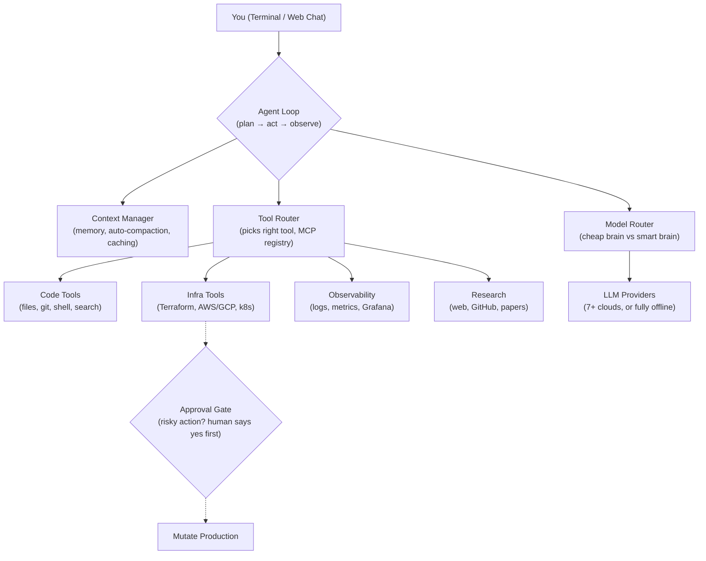
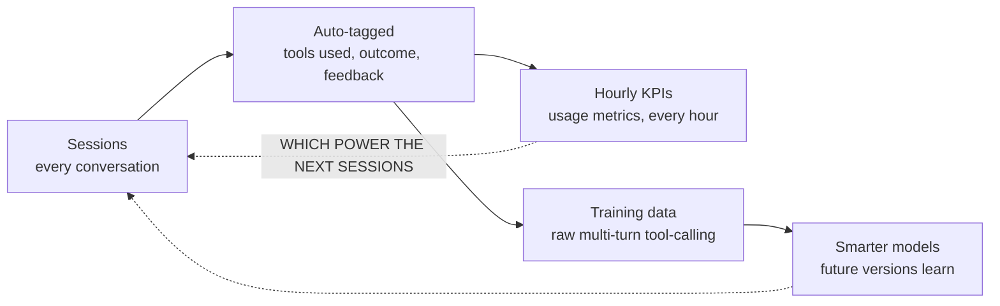

# PRODUCT REQUIREMENTS DOCUMENT · TEAM GUIDE
# Sentinel-Agent1

An autonomous AI teammate for platform engineering, AIOps, and MLOps — what it is, how every part works, and where it stands next to OpenRouter. Written so a newcomer can follow it end to end.

**IN ONE SENTENCE**
You describe a problem in plain English — "the deployment keeps crashing" — and it investigates with real tools (code, cloud, logs, dashboards), then fixes it, asking a human for approval before touching anything that could hurt production.

| REPO | INTERFACES | DEFAULT MODEL |
|---|---|---|
| Single-Core-Labs/Sentinel-Agent | Terminal · Web chat · Slack alerts | GLM 5.2 via internal gateway |

| SAFETY RULE | OPENROUTER |
|---|---|
| No production mutation without a human yes | Not used — similar idea, own build |

---

## PART A — How it works

### 01 The whole system in one picture
One brain, four helpers, and a hard safety gate in front of anything dangerous.

*FIG 1 — ARCHITECTURE: THE LOOP CONSULTS ITS MANAGERS, TOOLS DO THE WORK, THE GATE GUARDS PRODUCTION*

### 02 How one turn works
The five-beat rhythm, then the exact nine steps underneath it.

1. **Understand**: Reads your request and progress so far
2. **Pick a brain**: Cheap model for busywork, smart for hard thinking
3. **Decide**: Answer directly, or reach for a tool
4. **Safety check**: Risky? Stop and ask a human
5. **Act & repeat**: Run, learn from result, loop back

**The 9 Steps:**
1. **Cancel + compact check**: Did the user hit stop? Is memory near 90% full? Summarize old context first if so.
2. **Doom-loop detection**: Same tool called with the same inputs repeatedly? Break out instead of spinning forever.
3. **Model Router picks a model**: Classifies the step as mechanical or reasoning, routes to the cheap or strong model.
4. **Call the LLM**: One consistent call regardless of which provider is behind it (via the LiteLLM library).
5. **Tool calls, or done?**: If the model didn't ask for any tool, emit the final answer and stop.
6. **Tool Router dispatches**: Each requested tool call is routed to its implementation.
7. **Approval Gate check**: On the mandatory list? Show a preview diff and wait for a human yes.
8. **Execute**: Safe tools run, in parallel where possible.
9. **Feed results back**: Outputs join the conversation, and the loop returns to step 1.

### 03 Two brains: how model routing decides
It reads the plain-English description of the step it's about to take and matches keywords.

**Mechanical → cheap model**
Simple, verifiable busywork.
* Matches words like: `list`, `grep`, `search`, `find`, `format`, `lint`, `check`, `count`, `read`, `cat`, `head`, `tail`, `stat`

**Reasoning → strong model**
Judgment-heavy thinking.
* Matches words like: `plan`, `design`, `decide`, `debug`, `diagnose`, `architect`, `refactor`, `root cause`, `trade-off`, `evaluate`

> **THE FINE PRINT**
> Unrecognized wording defaults to the strong model — the safer miss. But an ambiguous step like "check the deployment" can route cheap even when it needs judgment, because `check` is a mechanical keyword. Every routing decision is written to an audit log with the step, classification, and model chosen — so cost and behavior stay inspectable, never silent.

### 04 What it can actually do
Seven toolkits, all usable in the same conversation.

* `{ }` **Code**: Reads, writes, edits files; searches the codebase; runs git and shell commands, locally or sandboxed.
* `☁` **Cloud & infra**: Plans and applies Terraform, checks AWS/GCP, manages Kubernetes deployments and Helm.
* `◈` **Observability**: Queries logs, metrics, traces; reads Grafana dashboards; can deploy its own pre-built dashboard.
* `⌕` **Research**: Web search, GitHub repo/file/example lookups, and ML research papers with citation graphs.
* `▤` **Data & ML**: Inspects datasets — validity, schema, sample rows — in one call. Built for the MLOps side of the job.
* `⧉` **Helper agents**: Spawns sub-agents with their own separate memory for background digging, so research never clutters the main conversation.
* `✉` **Notify**: Pings the team on Slack when it needs approval, hits an error, or finishes a turn.
* `≣` **Plan**: Decomposes a big task into structured steps before acting — each step then gets its own model routing.
* `⬒` **Sandboxes**: Spins up isolated cloud compute (CPU→H200 GPU) to run heavier work, with cost estimated up front.

### 05 Safety: it never goes rogue on production
Three actions always require a human — no setting, budget, or "yolo mode" can bypass this.

| ACTION | WHY IT'S GATED | STATUS |
|---|---|---|
| Restarting a service (`restart_service`) | Could cause a brief outage | ALWAYS ASKS |
| Scaling a deployment (`scale_deployment`) | Changes how many instances run | ALWAYS ASKS |
| Applying infra changes (`terraform_apply`) | Rewrites real cloud resources | ALWAYS ASKS |

Three layers of protection wrap every risky action: a **preview** (it shows exactly what would change before asking), the **approval** itself (Slack buttons or a terminal y/n), and a **checkpoint** (session state is snapshotted before executing, so an approved action that goes wrong can be rewound).

---

## PART B — Around the agent

### 06 Sessions: memory that survives
Conversations are durable objects, not throwaway chats.

Every conversation can be **saved, resumed, listed, or deleted**. Mid-session you can **undo** the last turn, **compact** memory when it gets long (it summarizes automatically at 90% capacity anyway), or **rewind** an approved cloud action to its pre-execution checkpoint. Long sessions stay cheap through diff-only context updates and prompt caching on providers that support it.

### 07 It gets better over time — the data flywheel
Every session becomes a lesson, not just a transcript.

*FIG 2 — THE FLYWHEEL: USE IT → IT LOGS → THE TEAM TRAINS ON THE LOGS → IT GETS SMARTER*

Tags cover which tools ran, whether the session **completed, errored, or doom-looped**, what GPU (if any) was used, and whether the user gave a thumbs up or down. Nothing is filtered at this stage — raw history plus tags, so the team can slice it later however they need.

### 08 It runs itself, too
Housekeeping that happens with no human babysitting.

* **Cleans up after itself**: A backstop job periodically finds and deletes sandbox environments the agent spun up and forgot to close.
* **Reviews its own code**: Every pull request to the project is automatically reviewed by an AI reviewer — with strict written rules — before a human looks.
* **Watches itself**: Ships its own monitoring stack (Grafana, Prometheus, tracing) so the team can see how the agent itself performs.
* **Ranks its own backlog**: A script collects open issues, PRs, and discussions, then asks an LLM to cluster and rank them by product impact.
* **Counts every dollar**: All spend events — LLM calls, sandbox create/destroy — are aggregated per app and per session for reporting.
* **Warns before it's expensive**: Spend thresholds (e.g. $5, $10) trigger warnings; a hard cap stops auto-approval entirely until a human weighs in.

### 09 Which AI models power it
Not locked to one company — switch with one command, or run fully offline.

| PROVIDER | MODELS | NOTES |
|---|---|---|
| **Internal gateway** | GLM 5.2 (default) | The team's own switchboard — see Part C |
| **Anthropic** | Claude family | Direct API |
| **OpenAI** | GPT + o-series | Direct API |
| **Google** | Gemini family | AI Studio key (not Vertex) |
| **DeepSeek · NVIDIA · Moonshot/GLM · GitHub Copilot** | Various | Direct APIs |
| **Your own machine** | Ollama · vLLM · LM Studio · llama.cpp | Fully offline — no internet needed for thinking |

---

## PART C — Sentinel-Agent1 & OpenRouter

### 10 Is this the same thing as OpenRouter?
No — but they rhyme. One is a switchboard; the other is the worker who takes the call.

Think of **OpenRouter** as a phone switchboard: you say "connect me to GPT-4" and it dials that number — nothing more. **Sentinel-Agent1** is the person who picks up and actually does the work: reads code, runs commands, fixes servers. That worker still needs a phone line to think — and Sentinel-Agent1 built its *own* switchboard instead of subscribing to OpenRouter's. A full search of the codebase finds zero OpenRouter references.

| QUESTION | ANSWER |
|---|---|
| **Does Sentinel-Agent1 use OpenRouter?** | No — zero references anywhere in the code, config, or dependencies. |
| **Do they compete?** | Not directly. OpenRouter routes *API calls* between providers; Sentinel-Agent1 routes *work* — steps of a task — and does the task itself. |
| **Where's the similarity?** | The internal gateway plays the same role for this team that OpenRouter plays for everyone else: one connection, many models. |
| **Could they combine?** | Yes, easily — the LiteLLM library it uses already supports OpenRouter. It would be one config change, and nothing in the agent would need to know. |
| **Why build their own?** | Control over billing, a house default model (GLM 5.2), and no third-party dependency on a product-critical path. |

### 11 What it costs to run — two pricing philosophies
Sentinel-Agent1's pricing is a safety mechanism; OpenRouter's pricing is a business model.

**Sentinel-Agent1 (A spending limit, not a price tag)**
* You set a dollar cap — auto-approval stops once spend nears it
* Warnings fire at thresholds ($5, $10, …)
* Sandbox compute has fixed hourly rates: free (basic CPU) → $0.60/hr (small GPU) → $80/hr (8× H200)
* AI thinking cost is tracked live per session, not fixed in advance
* If a cost can't be estimated safely, it falls back to asking a human

**OpenRouter (A marketplace with a small toll)**
* No subscription, no markup — providers' own prices pass straight through
* ~5.5% fee when you top up your balance (min $0.80 by card; 5% flat via crypto)
* Bring-your-own-key: 5% fee only past 1M requests/month
* Real free tier: 25+ free models, daily free-request quota
* Net effect: load $1,000 → about $945 usable for inference

> **THE HONEST READ**
> These aren't competing price sheets. Sentinel-Agent1's numbers exist to stop the agent overspending before a human notices; OpenRouter's numbers are how the company earns money. If the agent ever routed through OpenRouter, its cap-and-warn logic would keep working unchanged — it only cares about the dollar amount, not who set the price.

---

## PART D — The PRD

### 12 Problem, goal, and who it's for

**Problem.** Platform, SRE, and MLOps engineers lose hours to work that is mechanical *and* risky at the same time: debugging crash-looping deployments, writing and reviewing Terraform, chasing answers across logs and dashboards. Existing coding agents live in the IDE — they don't reach into cloud infra or observability, and they have no concept of "this action could take down production."

**Goal.** An agent that researches, writes, and safely applies infrastructure and code changes end to end — with mandatory human approval on anything that mutates production, and a full audit trail of every decision it makes.

**Users.** Platform/DevOps engineers wanting a copilot for infra work; on-call responders wanting fast root-cause plus guarded remediation; MLOps engineers managing model-serving infra; any team that wants Slack-visible, approval-gated automation instead of blind auto-apply.

**Non-goals.** Not a general chat product. Not a CI/CD replacement. And never — by design, not by default — a system that mutates production without a human yes.

### 13 Requirements at a glance
All implemented in the current repo unless marked open.

| AREA | REQUIREMENT |
|---|---|
| **Agent loop** | Bounded plan→act→observe iterations; doom-loop detector; optional plan-first mode |
| **Model routing** | Mechanical vs reasoning classification per step; cheap/strong routing; per-step override; full audit log; automatic fallback on provider errors |
| **Tools** | Code, infra, observability, research, data/ML, sub-agents, planning, Slack notify; extensible via MCP registry |
| **Safety** | Non-bypassable approval on the three mutating ops; preview diff before asking; checkpoint + rewind after |
| **Context** | Auto-compaction at 90% capacity; diff-only updates; prompt caching where supported |
| **Sessions** | New / resume / list / delete; undo last turn; force compact; graceful save on shutdown |
| **Interfaces** | Interactive terminal; headless mode for CI; web app; one-way Slack notifications |
| **Learning** | Auto-tagged session trajectories; hourly KPI rollups; raw training-data export |
| **Cost control** | Spend caps, threshold warnings, per-session billing IDs, up-front sandbox cost estimates |
| **Ops hygiene** | Orphan-sandbox sweeper; AI-reviewed PRs with written review rules; self-monitoring stack |

### 14 Success metrics, risks, and open questions

**Metrics.** 
* 100% of mutating actions through approval with zero bypass incidents
* Median time-to-resolution vs manual baseline for on-call-class tasks
* Cost per task (cheap/strong split from the routing audit log)
* Rewind rate trending down as previews improve.

**Risks.** 
* The keyword-based step classifier is a heuristic — an ambiguous step can silently get the weaker model (mitigated by the audit log, but only if someone reads it). 
* The approval gate's mandatoriness lives in code, so any refactor of that file deserves the strictest review. 
* Slack is notify-only — the actual y/n still happens at a terminal or in the web app; teams should know the button in Slack is a doorbell, not a door.

**Open questions.** 
* Should OpenRouter (or similar) be offered as an alternate transport for teams that want provider-agnostic billing without running a gateway? 
* What is the sandbox isolation boundary — per session or per call? 
* Is there a team/multi-user session-sharing roadmap? 
* Should the keyword classifier eventually be replaced by a small learned model?

### 15 Quick questions, plain answers

**Q: Can it break production by accident?**
No — restarts, scaling, and infra applies always need a human's yes, and that rule can't be switched off.

**Q: Does it use OpenRouter?**
No. It has its own gateway plus direct provider lines. It could switch to OpenRouter with one config change — it just doesn't today.

**Q: Can it work offline?**
Yes — it supports models running fully on your own machine.

**Q: What does it cost beyond the AI bill?**
Only sandbox compute, at a published hourly rate shown up front — basic CPU is free.

**Q: Do I need to be technical to use it?**
You talk to it in plain English, by chat or terminal. It picks the tools.

**Q: What if I approve something and it goes wrong?**
It checkpoints before every approved risky action, so that action can be rewound.

**Q: Is it locked to one AI company?**
No — 7+ providers plus local models; switching is one command.

**Q: Can it get stuck in a loop and burn money?**
Iterations are capped, repeated identical tool calls trip a doom-loop detector, and spend caps halt auto-approval.
